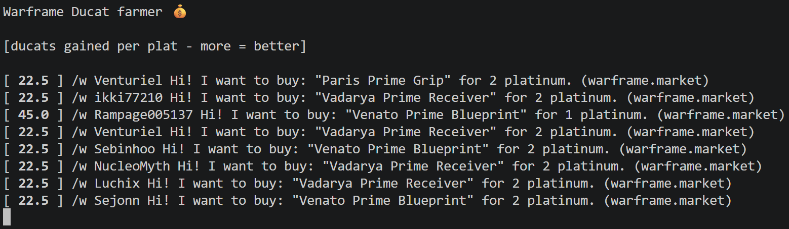

# Warframe Ducats Farmer 🧑‍🌾

## Overview 🗺️
- Current stable version - v3 (Windows only)



## How to start? (v3) - Windows 🪟

- use PowerShell

```bash
# clone this repo
git clone https://github.com/MikolajZasko/warframe_ducats_farmer.git
```

```bash
# go into the project's main directory
cd warframe_ducats_farmer

# create a .venv in the root directory of the repo, next to .gitignore
python -m venv .venv

# install requirements
.\.venv\Scripts\pip.exe install -r requirements.txt

# start the project using the main entry point
.\run.ps1
```

# A deeper dive into the project 🥽

## Why was it created? 🤔

Once upon a time, while playing Warframe I needed some ducats. So... I searched the market webside manually. Then decided to automate it 😁 .

## What does it do? 🤔

Finds best current listings when it comes to plat -> ducats ratio. (listed on https://warframe.market/)

## Why no version for linux? 🤔

Yes - playing games on Linux is possible BUT setting up the game itself requires some "Translation" (Wine). The fact that a game can work on wine version X and crash on version X + 1 AND other inconsistencies when it comes to gaming on Linux makes the Linux version obsolete. The scraping process can be done on a Linux machine, but the data changes so quickly that saving it for later does not make any sense (the main usage of the tool for now is using python's "print" function and copying the output directly to the ingame chat - if you want to grab the best deals, you have to be quick 😎)

## Project structure 🌳
```bash
.                             
├── config                    # config directory
│   ├── helper_functions.py   # functions used in the project
│   └── settings.py           # ⚙️ settings that change the behaviour of the project 
├── data                      # data directory
│   ├── deals.txt             # 💰 file containing [ducats gained per plat] + message to user 
│   ├── deals_desperate.txt   # worse deals, open if desperate for ducats
│   └── itemLinks.json        # links to items found https://warframe.market/tools/ducats - during the launch of the script
├── gfx                       # images used in the readme.md file
│   └── ...                   # 
├── old_versions              # old versions of the project
│   └── ...                   # 
├── testing                   # directory containing tests of separate functions in helper_functions.py
│   └── ...                   # 
├── .gitignore                # specifies untracked files to ignore in Git
├── primeJunk_get_links.py    # 1️⃣ a script that gets links to items (ran first in the project )
├── primeJunk_v3.py           # 2️⃣ a script that scrapes the market in search of best deals (ran second in the project)
├── readme.md                 # this file
├── requirements.txt          # requirements for venv
└── run.ps1                   # 🚀 main entry point to the project 
```